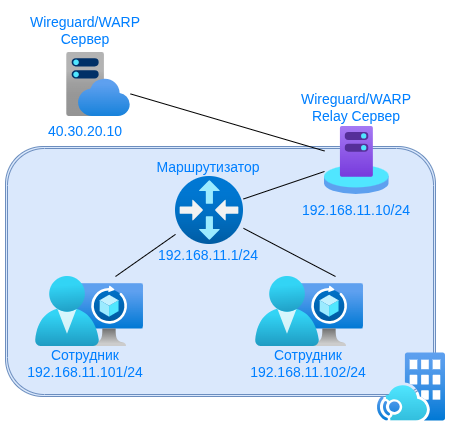

# Wireguard / WARP Relay

<p align="left">
  
</p>
<p align="left">
  <b>Relay-сервер для Wireguard и Cloudflare WARP</b>
</p>

<p align="left">
  <a href="#-описание">Описание</a> •
  <a href="#-для-кого">Для кого</a> •
  <a href="#-системные-требования">Системные требования</a> •
  <a href="#-быстрый-старт">Быстрый старт</a> •
  <a href="#-использование">Использование</a> •
  <a href="#-лицензия">Лицензия</a>
</p>

---

## 📋 Описание

**WARP Relay** — это решение для организаций, где по соображениям информационной безопасности запрещен прямой доступ к внешним ресурсам (глобальный интернет), но сотрудникам необходимо подключаться к корпоративным VPN-серверам (Wireguard или Cloudflare WARP).

> ⚠️ **Примечание:** В скриптах в качестве примера используется адрес `engage.cloudflareclient.com` — это endpoint бесплатного сервиса Cloudflare WARP, который приведён для демонстрации и быстрого тестирования работы Wireguard / WARP Relay. Автор проекта не имеет никакого отношения к компании Cloudflare, Inc. В продуктивных контурах вы должны использовать исключительно корпоративный VPN сервер, указав его IP-адрес и порт вручную.

### Как это работает

В сети организации размещается **Relay-сервер**, имеющий доступ к внешней сети. Сотрудники подключаются к внешнему корпоративному VPN-серверу через внутренний IP-адрес Relay-сервера.

<p align="left">
  
</p>

**Описание схемы:**

На схеме представлена корпоративная сеть организации `192.168.11.0/24`. Рабочие станции сотрудников (`192.168.11.101`, `192.168.11.102`) не имеют прямого доступа к внешней сети Интернет по соображениям информационной безопасности. Однако сотрудникам необходимо подключаться к корпоративному VPN-серверу Wireguard, расположенному в центральном офисе с публичным IP-адресом `40.30.20.10`.

Для решения этой задачи в локальной сети развёрнут **Wireguard / WARP Relay сервер** (`192.168.11.10`), имеющий выход в Интернет. На Relay-сервере выполняется настройка iptables для перенаправления трафика:

```bash
export TAG="WR_RULE"
export SRC_IP=192.168.11.10
export DST_IP=40.30.20.10
export SRC_PORT=2288
export DST_PORT=51820

echo "net.ipv4.ip_forward=1" > /etc/sysctl.d/ipv4-forwarding.conf
sysctl -w net.ipv4.ip_forward=1

iptables -t nat -A PREROUTING \
  -d ${SRC_IP} -p udp --dport ${SRC_PORT} \
  -j DNAT --to-destination ${DST_IP}:${DST_PORT} \
  -m comment --comment "${TAG}"

iptables -t nat -A POSTROUTING \
  -p udp -d ${DST_IP} --dport ${DST_PORT} \
  -j MASQUERADE \
  -m comment --comment "${TAG}"

iptables -A FORWARD -p udp -d ${DST_IP} --dport ${DST_PORT} -j ACCEPT -m comment --comment "${TAG}"
iptables -A FORWARD -p udp -s ${DST_IP} --sport ${DST_PORT} -j ACCEPT -m comment --comment "${TAG}"

echo iptables-persistent iptables-persistent/autosave_v4 boolean true | sudo debconf-set-selections
echo iptables-persistent iptables-persistent/autosave_v6 boolean true | sudo debconf-set-selections
sudo DEBIAN_FRONTEND=noninteractive apt install -y iptables-persistent
iptables-save > /etc/iptables/rules.v4
```

**Результат:** сотрудникам для подключения к корпоративному VPN достаточно указать внутренний адрес Relay-сервера `192.168.11.10:2288`. Весь трафик автоматически перенаправляется на внешний Wireguard-сервер `40.30.20.10:51820`, при этом сотрудники не имеют прямого доступа в Интернет.

### Сценарии использования

- 🔒 **Корпоративная сеть без интернета** — сотрудники могут подключаться к внешнему VPN через внутренний relay
- 🏢 **Филиалы и удаленные офисы** — централизованный доступ к корпоративной сети через единую точку входа
- 🛡️ **Соответствие ИБ-требованиям** — внешний доступ только через контролируемый сервер
- ☁️ **Cloudflare WARP** — подключение к WARP через внутренний relay для Zero Trust доступа

---

## 👥 Для кого

Этот проект предназначен для:

- **Сетевых инженеров** — настройка и поддержка сетевой инфраструктуры
- **Системных администраторов** — развертывание и обслуживание серверов
- **DevOps / SRE** — автоматизация и интеграция в инфраструктуру

---

## 💻 Системные требования

### Минимальные требования к виртуальной машине/серверу

| Параметр | Минимум | Рекомендуется |
|----------|---------|---------------|
| CPU | 1 vCPU | 2 vCPU |
| RAM | 512 MB | 1 GB |
| Диск | 5 GB | 10 GB |
| Сеть | 1 интерфейс с доступом во внешнюю сеть | 2 интерфейса (внутренний + внешний) |

### Требования к операционной системе

- **Ubuntu** 20.04 LTS / 22.04 LTS / 24.04 LTS
- **Debian** 11 / 12
- Другие дистрибутивы на базе Debian (с адаптацией команд)

### Требования к программному обеспечению

- `iptables` — для настройки правил NAT и forwarding
- `curl` — для определения внешнего IP-адреса
- `iptables-persistent` — для сохранения правил после перезагрузки
- `getent` — для DNS-разрешения (обычно входит в базовую поставку)

### Сетевые требования

- ✅ Доступ к внешней сети (интернет) для Relay-сервера
- ✅ UDP порт 4500 (по умолчанию) должен быть открыт для входящих соединений
- ✅ Включен IP forwarding в ядре Linux

---

## 🚀 Быстрый старт

### Установка одной командой

```bash
curl -fsSL https://raw.githubusercontent.com/bekirovtimur/warp-relay/main/wr.sh | sudo bash
```

Или скачайте и запустите скрипт:

```bash
wget https://raw.githubusercontent.com/bekirovtimur/warp-relay/main/wr.sh
chmod +x wr.sh
sudo ./wr.sh
```

### Простая установка (без интерактивного меню)

**Вариант 1 — один UDP-порт (стандартный режим)**

```bash
curl -fsSL https://raw.githubusercontent.com/bekirovtimur/warp-relay/main/simple.sh | sudo bash
```

**Вариант 2 — несколько UDP-портов одновременно (мультипорт)**

```bash
curl -fsSL https://raw.githubusercontent.com/bekirovtimur/warp-relay/main/simple_multiport.sh | sudo bash
```

Скрипт автоматически настраивает проброс для следующих UDP-портов (например используются порты Cloudflare WARP):
```
500   854   859   864   878   880   890   891   894   903
908   928   934   939   942   943   945   946   955   968
987   988   1002  1010  1014  1018  1070  1074  1180  1387
1701  1843  2371  2408  2506  3138  3476  3581  3854  4177
4198  4233  4500  5279  5956  7103  7152  7156  7281  7559
8319  8742  8854  8886
```
Если клиент подключается к Relay-серверу по порту X,
то трафик будет перенаправлен на внешний сервер на тот же самый порт X.

---

## 📖 Использование

### Интерактивный скрипт `wr.sh`

Интерактивный скрипт с меню для удобного управления:

```bash
sudo ./wr.sh
```

**Доступные опции:**

1. **Автонастройка (Cloudflare UDP 4500)** — автоматическое определение IP-адресов и настройка для Cloudflare WARP
2. **Ввести параметры вручную** — ручной ввод IP-адресов и портов для кастомной конфигурации
3. **Показать Relay правила файрволла** — просмотр текущих iptables правил
4. **Откат изменений (удаление)** — полное удаление всех настроек и правил
5. **Выход** — завершение работы скрипта

### Простой скрипт `simple.sh`

Быстрая установка без интерактивного меню:

```bash
sudo ./simple.sh
```

**Что делает скрипт:**
- Определяет внешний IP сервера (`ifconfig.me`)
- Определяет IP Cloudflare WARP (`engage.cloudflareclient.com`)
- Настраивает iptables правила для UDP порта 4500
- Включает IP forwarding
- Сохраняет правила для автозагрузки

### Ручная настройка

Если необходимо настроить вручную:

```bash
# Включить IP forwarding
echo "net.ipv4.ip_forward=1" > /etc/sysctl.d/ipv4-forwarding.conf
sysctl -w net.ipv4.ip_forward=1

# Настроить iptables (пример для Cloudflare WARP)
SRC_IP="YOUR_SERVER_IP"
DST_IP="$(getent ahostsv4 engage.cloudflareclient.com | awk '{print $1; exit}')"
SRC_PORT=4500
DST_PORT=4500

# DNAT правило
iptables -t nat -A PREROUTING \
  -d ${SRC_IP} -p udp --dport ${SRC_PORT} \
  -j DNAT --to-destination ${DST_IP}:${DST_PORT} \
  -m comment --comment "WR_RULE"

# MASQUERADE правило
iptables -t nat -A POSTROUTING \
  -p udp -d ${DST_IP} --dport ${DST_PORT} \
  -j MASQUERADE \
  -m comment --comment "WR_RULE"

# Разрешить forwarding
iptables -A FORWARD -p udp -d ${DST_IP} --dport ${DST_PORT} -j ACCEPT -m comment --comment "WR_RULE"
iptables -A FORWARD -p udp -s ${DST_IP} --sport ${DST_PORT} -j ACCEPT -m comment --comment "WR_RULE"

# Сохранить правила
echo iptables-persistent iptables-persistent/autosave_v4 boolean true | sudo debconf-set-selections
echo iptables-persistent iptables-persistent/autosave_v6 boolean true | sudo debconf-set-selections
sudo DEBIAN_FRONTEND=noninteractive apt install -y iptables-persistent
iptables-save > /etc/iptables/rules.v4
```

---

## 🔧 Примеры использования

### Пример 1: Подключение к Cloudflare WARP

```bash
# На Relay-сервере
sudo ./wr.sh
# Выбрать пункт 1 - Автонастройка

# На клиенте настроить подключение WARP:
# Endpoint: IP_адрес_Relay_сервера:4500
```

### Пример 2: Кастомный Wireguard сервер

```bash
# На Relay-сервере
sudo ./wr.sh
# Выбрать пункт 2 - Ввести параметры вручную
# Ввести IP вашего Wireguard сервера и нужный порт

# На клиенте настроить Wireguard:
# Endpoint: IP_адрес_Relay_сервера:ПОРТ
```

### Пример 3: Проверка работы

```bash
# На Relay-сервере проверить правила
sudo ./wr.sh
# Выбрать пункт 3 - Показать Relay правила файрволла

# Или вручную:
iptables -t nat -L -n -v | grep WR_RULE
iptables -L FORWARD -n -v | grep WR_RULE
```

---

## 🗑️ Удаление / Откат

Для полного удаления настроек:

```bash
sudo ./wr.sh
# Выбрать пункт 4 - Откат изменений (удаление)
```

Или вручную:

```bash
# Удалить правила с тегом WR_RULE
iptables -t nat -S | grep "WR_RULE" | sed 's/^-A/-D/' | while read rule; do
    iptables -t nat $rule
done

iptables -S | grep "WR_RULE" | sed 's/^-A/-D/' | while read rule; do
    iptables $rule
done

# Отключить IP forwarding
echo "net.ipv4.ip_forward=0" > /etc/sysctl.d/ipv4-forwarding.conf
sysctl -w net.ipv4.ip_forward=0

# Сохранить изменения
iptables-save > /etc/iptables/rules.v4
```

---

## 📁 Структура проекта

```
warp-relay/
├── img/
│   ├── logo.png              # Логотип проекта
│   ├── warp-relay.png        # Схема работы
│   └── warp-relay.drawio     # Исходник схемы
├── simple.sh                 # Простая установка (один UDP-порт)
├── simple_multiport.sh       # Простая установка (несколько UDP-портов)
├── wr.sh                     # Интерактивный скрипт
└── README.md                 # Документация
```

---

## ⚠️ Безопасность

- 🔐 Все iptables правила помечены тегом `WR_RULE` для легкого управления
- 📝 Скрипты требуют прав root (sudo)
- 🔄 IP forwarding включается только для необходимого трафика
- 💾 Правила автоматически сохраняются для переживания перезагрузок

---

## 🐛 Устранение неполадок

### Проблема: Не определяется внешний IP

```bash
# Проверить доступность ifconfig.me
curl -4s ifconfig.me
# Если не работает, используйте альтернативу:
curl -4s icanhazip.com
# Или укажите адрес вручную задав значение переменной SRC_IP:
```

### Проблема: Правила не сохраняются после перезагрузки

```bash
# Проверить установку iptables-persistent
dpkg -l | grep iptables-persistent

# Пересохранить правила вручную
sudo iptables-save > /etc/iptables/rules.v4
```

### Проблема: Нет соединения через relay

```bash
# Проверить включен ли IP forwarding
sysctl net.ipv4.ip_forward

# Проверить правила iptables
sudo iptables -t nat -L -n -v
sudo iptables -L FORWARD -n -v

# Проверить логи ядра
sudo dmesg | grep -i iptables
```

---

## 🤝 Вклад в проект

Приветствуются pull requests и issues! Если у вас есть идеи по улучшению или вы нашли баг — создайте issue на GitHub.

---

## 📄 Лицензия

Этот проект распространяется под лицензией **MIT**.

Подробности смотрите в файле [LICENSE](LICENSE).